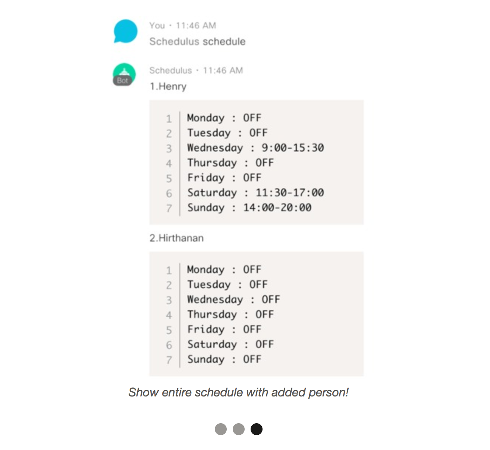

# Schedulus

Schedulus is a timetable management chatbot built on the Cisco Spark platform (Workspace messenger), helping organizations have full control over managing employee schedules.

This App is built using Cisco Spark's API, NodeJS, Express, and Firebase.

## Screenshots

| View Commands | Add Employees | View Schedule |
|:-------------:|:-------------:|:-------------:|
|  |  |  |

## Build instructions

1. Clone this repository.
2. Follow the instructions below to instantiate the server and run the Cisco Spark chatbot.

### Node.js Server

1. `cd` into `server` directory and run `npm install`
2. Create ciscosparkSecret.js, firebaseSecret.js, and serverSecret.js files in `server` with working credentials.
3. Start the server with `npm start`

## Devpost Submission

This hack was created for [McHacks 2018](https://mchacks.ca) and was submitted to Devpost [here](https://devpost.com/software/schedulus)

### Inspiration

One of our team members, Zi, used to work for Tim Hortons. He was tired of waiting for his manager to post the weekly schedules on the corkboard in the staff room. He was tired of having to wait until he came to work to find out about his next week's schedule, he was tired of taking pictures of the schedule for his coworkers, and he was tired of having to pencil in the changes whenever he wanted to modify his schedule, needing to personally contact his coworkers to let them know about the new schedule update.

This gave rise to Schedulus, where all of Zi's scheduling nightmares would come to an end.

### What it does

Schedulus helps businesses stay organized by allowing employees to check, post, and update the schedules all from the palm of their hands, in Cisco Spark.

### How we built it

After exploring the basics of Cisco Spark, we decided to add a chatbot to the application. We would use webhooks to communicate between the Cisco Spark API and our Express Server. We stored all the scheduling data through Firebase as it was quick, simple and straightforward to setup.

### Challenges we ran into

Since it was our first time using Cisco Spark's API, we didn't really understand the API documentations at first glance, but with the help of the mentors (who were extremely patient and helpful), we were able to use the API to fulfill our purpose.

### Accomplishments that we're proud of

We were able to turn what we thought were just ideas into an actual minimum viable product!

### What we learned

How to use Cisco Spark's API and how to build a Cisco Spark chatbot, how scheduling in businesses can be inefficient from retail stores to fastfood chains to corporations.

### What's next for Schedulus

* Adding User Authentication to control who can manage the schedule (i.e management approval for shift changes)
* Push Notifications for adding/dropping shifts
* Converting the current schedule output into a fancier table, improving the UI
* Tracking the amount of hours worked for each week and adding limitations/rules (i.e. part-time workers shouldn't be able to add more shifts than they're allowed to work for)
